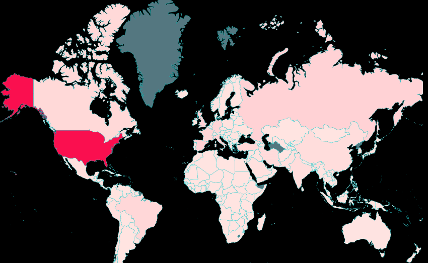

## jiffylime
A NodeJS Demo App built with Express.js, Bunyan/Morgan logging and good ol' native Promises with Axios.  

#### *featuring*:
  * a D3.js data visualization using the Vue.js framework 
  * caching via Redis
  * all wrapped in a Docker-ized container with a baked-in ELK stack for log tracking/analysis
  * Enjoy (...or cry) and be in good health!! 

> #### *Total Covid-19 cases around the world   (updated daily in realtime)*
   
#### .

> #### *...and...removing the United States from the dataset to better illustrate the color contrasts (more red = more cases)*

